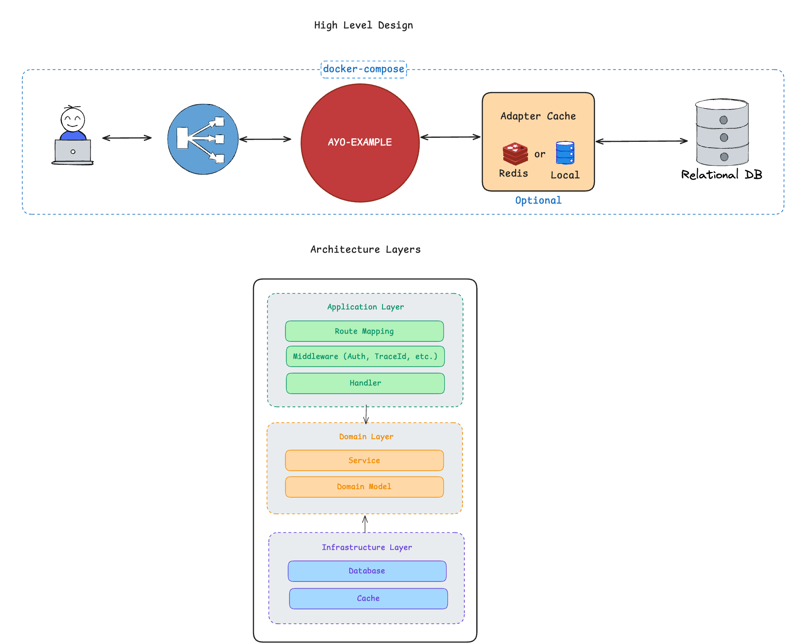

# Ayo Example

Ayo Example adalah aplikasi backend REST API untuk manajemen tim, pemain, dan pertandingan liga.

Proyek ini telah dideploy ke Railway — akses API di: https://ayo-example-production.up.railway.app/api



## Deskripsi Aplikasi

Aplikasi ini menyediakan layanan:
1. autentikasi pengguna dengan JWT
2. manajemen tim (create, update, delete, list)
3. manajemen pemain dan penugasan pemain ke tim
4. manajemen pertandingan liga: buat match, catat goal, finish match, assign lineup


## Cara Menjalankan dengan Docker Compose

1. Pastikan Docker dan Docker Compose sudah terpasang.
2. Jalankan perintah:

```bash
make compose-up
# or
docker compose up -d

```

3. Akses aplikasi di `http://localhost:8282` (atau port yang dikonfigurasi di lingkungan).
4. Untuk menghentikan layanan, gunakan:

```bash
make compose-down
# or
docker compose down -v
```

## Menjalankan Test

```bash
go test ./...
```


## Dokumen API

Dokumentasi lengkap API tersedia [disini](API.md).

## Pengembangan Berikutnya

1. Cache layer
   - Tambahkan cache seperti Redis atau memcached untuk mempercepat respons read-heavy endpoint.
   - Cache dapat mengurangi latensi dan beban database untuk data tim, pemain, dan highlight pertandingan.

2. Monorepo dengan FE
   - Susun ulang repo menjadi monorepo yang menyimpan backend dan frontend dalam satu workspace.
   - Frontend bisa dibuat dengan React, Vue, atau Svelte untuk antarmuka manajemen tim dan skor pertandingan.

3. Rekomendasi peningkatan fitur lain
   - Tambahkan validasi input dan error handling agar respon API lebih konsisten.
   - Tambahkan logging dan monitoring (misalnya Prometheus + Grafana) untuk observability.
   - Sertakan mekanisme refresh token JWT untuk pengalaman autentikasi yang lebih baik.

---