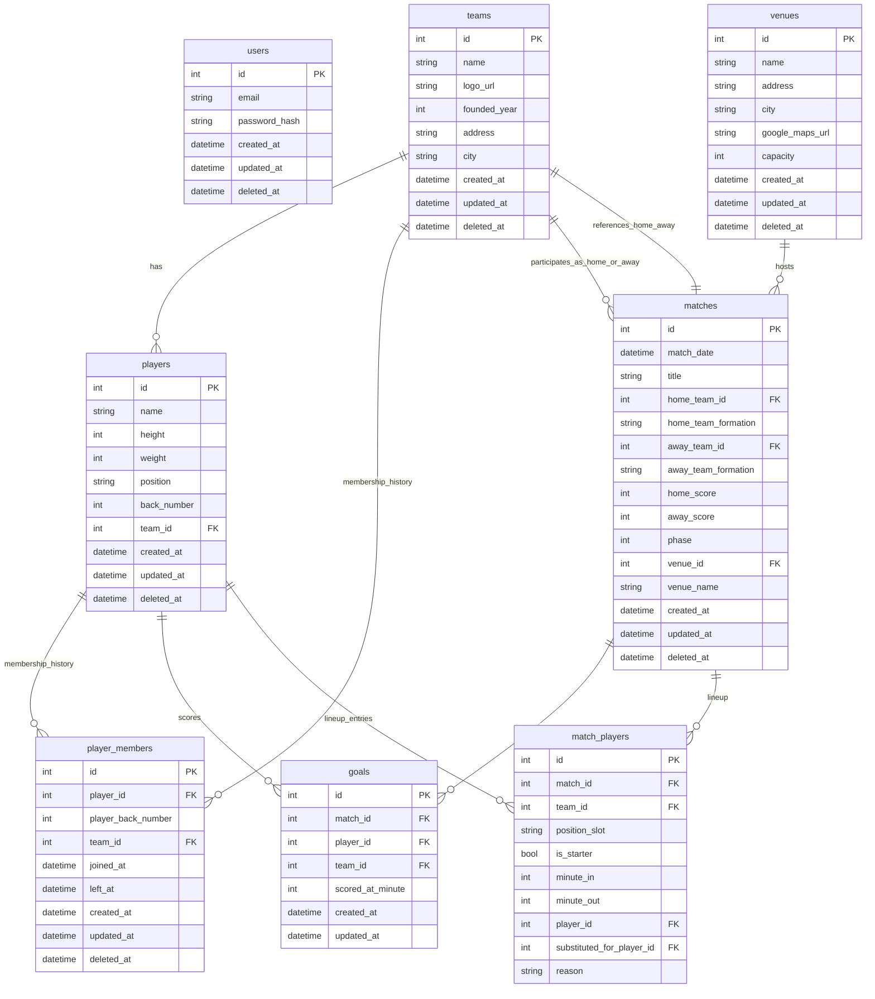

# Ayo Example

Ayo Example adalah aplikasi backend REST API untuk manajemen tim, pemain, dan pertandingan liga.

Proyek ini telah dideploy ke Railway — akses API di: https://ayo-example-production.up.railway.app/api


## Deskripsi Aplikasi

Aplikasi ini menyediakan layanan:
1. autentikasi pengguna dengan JWT
2. manajemen tim (create, update, delete, list)
3. manajemen pemain dan penugasan pemain ke tim
4. manajemen pertandingan liga: buat match, catat goal, finish match, assign lineup

## Data Model & ERD

Diagram ERD berikut menggambarkan relasi utama antar model database di aplikasi ini.



### Model field reference

#### User
- `id`: primary key.
- `email`: unique login identifier.
- `password_hash`: hashed password.
- `created_at`, `updated_at`: standard timestamps.
- `deleted_at`: soft-delete marker.

#### Team
- `id`: primary key.
- `name`: nama tim.
- `logo_url`: URL logo tim.
- `founded_year`: tahun berdiri.
- `address`, `city`: lokasi tim.
- `players`: relasi satu-ke-banyak ke `Player`.
- `created_at`, `updated_at`, `deleted_at`: timestamps dan soft delete.

#### Player
- `id`: primary key.
- `name`: nama pemain.
- `height`, `weight`: atribut fisik pemain.
- `position`: posisi lapangan.
- `back_number`: nomor punggung.
- `team_id`: referensi tim saat ini.
- `team`: relasi ke `Team`.
- `player_memberships`: riwayat keanggotaan tim.
- `created_at`, `updated_at`, `deleted_at`: metadata.

#### PlayerMember
- `id`: primary key.
- `player_id`: referensi pemain.
- `player_back_number`: nomor punggung saat bergabung.
- `team_id`: referensi tim.
- `joined_at`: waktu bergabung.
- `left_at`: waktu keluar.
- `player`, `team`: relasi model.
- `created_at`, `updated_at`, `deleted_at`: metadata.

#### Venue
- `id`: primary key.
- `name`: nama stadion/venue.
- `address`, `city`: alamat lokasi.
- `google_maps_url`: URL peta.
- `capacity`: kapasitas penonton.
- `created_at`, `updated_at`, `deleted_at`: metadata.

#### Match
- `id`: primary key.
- `match_date`: waktu pertandingan.
- `title`: judul atau catatan pertandingan.
- `home_team_id`, `away_team_id`: referensi tim kandang/tandang.
- `home_team_formation`, `away_team_formation`: formasi tim.
- `home_score`, `away_score`: skor akhir.
- `phase`: status pertandingan (`1` aktif, `2` dibatalkan, `3` selesai).
- `goals`: daftar gol dalam pertandingan.
- `player_lineup`: daftar susunan pemain.
- `venue_id`: referensi venue.
- `venue_name`: nama venue tersimpan.
- `venue`: relasi `Venue`.
- `created_at`, `updated_at`, `deleted_at`: metadata.

#### Goal
- `id`: primary key.
- `match_id`: referensi pertandingan.
- `player_id`: referensi pencetak gol.
- `team_id`: referensi tim pencetak.
- `scored_at_minute`: menit gol.
- `created_at`, `updated_at`: metadata.

#### MatchPlayerLineup
- `id`: primary key.
- `match_id`: referensi pertandingan.
- `team_id`: referensi tim yang bermain.
- `position_slot`: posisi di lapangan.
- `is_starter`: apakah starter atau cadangan.
- `minute_in`, `minute_out`: menit masuk dan keluar.
- `player_id`: referensi pemain.
- `substituted_for_player_id`: pemain yang digantikan.
- `reason`: alasan pergantian.


## Cara Menjalankan dengan Docker Compose

1. Pastikan Docker dan Docker Compose sudah terpasang.
2. Jalankan perintah:

```bash
make compose-up
# or
docker compose up -d

```

3. Akses aplikasi di `http://localhost:8282` (atau port yang dikonfigurasi di lingkungan).
4. Untuk menghentikan layanan, gunakan:

```bash
make compose-down
# or
docker compose down -v
```

## Menjalankan Test

```bash
go test ./...
```


## Dokumen API

Dokumentasi lengkap API tersedia [disini](API.md).

## Pengembangan Berikutnya

1. Cache layer
   - Tambahkan cache seperti Redis atau memcached untuk mempercepat respons read-heavy endpoint.
   - Cache dapat mengurangi latensi dan beban database untuk data tim, pemain, dan highlight pertandingan.

2. Monorepo dengan FE
   - Susun ulang repo menjadi monorepo yang menyimpan backend dan frontend dalam satu workspace.
   - Frontend bisa dibuat dengan React, Vue, atau Svelte untuk antarmuka manajemen tim dan skor pertandingan.

3. Rekomendasi peningkatan fitur lain
   - Tambahkan validasi input dan error handling agar respon API lebih konsisten.
   - Tambahkan logging dan monitoring (misalnya Prometheus + Grafana) untuk observability.
   - Sertakan mekanisme refresh token JWT untuk pengalaman autentikasi yang lebih baik.

---